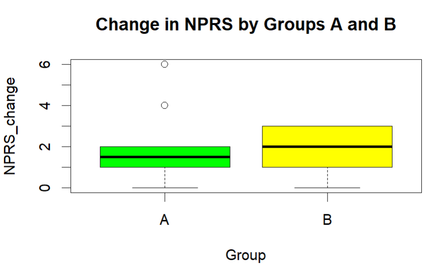

# Non-Parametric Tests: Pain Reduction Analysis (NPRS)

## Project Overview
This project presents a non-parametric statistical analysis conducted in R to evaluate changes in pain levels before and after treatment.  
The analysis compares a test drug with a placebo using appropriate non-parametric methods.

## Business Context
In a randomized controlled trial, **32 patients** were divided into two groups:
- **Group A** — received a test drug  
- **Group B** — received a placebo  

Pain levels were measured using the **Numerical Pain Rating Scale (NPRS)** before treatment and after 3 days.  
Higher NPRS values indicate greater pain.

## Objectives
1. Compare pain levels before and after treatment  
2. Assess whether post-treatment pain is significantly lower within each group  
3. Evaluate whether pain reduction differs between Group A and Group B  

## Dataset
The dataset (`NPRS_DATA.csv`) is included in the repository and located in the root directory.  
It contains observations from **32 patients**.

### Dataset Description
Key variables:
- `NPRS_before` — pain score before treatment  
- `NPRS_after` — pain score after treatment  
- `Group` — treatment group (`A`, `B`)  

## Analysis Workflow
1. Data import and structure inspection  
2. Descriptive statistics (median and mean pain scores)  
3. Normality assessment  
4. Wilcoxon signed-rank tests within groups  
5. Kruskal–Wallis test to compare pain reduction between groups  
6. Visualization of pain reduction  

## Methods and Techniques
- Descriptive statistics
- Normality tests:
  - Shapiro–Wilk test
  - Lilliefors (Kolmogorov–Smirnov) test
- Non-parametric statistical tests:
  - Wilcoxon signed-rank test
  - Kruskal–Wallis test
- Data visualization

## Key Findings
- Median and mean pain scores decreased after treatment  
- No statistically significant reduction in pain was detected within either group  
- No statistically significant difference in pain reduction was observed between Group A and Group B  
- Variability in pain response was higher in the treatment group

## Visualization

## Tools and Skills
- R
- Non-parametric hypothesis testing
- Medical data analysis
- Data visualization

## How to Run the Project
1. Clone the repository  
2. Open the R script  
3. The dataset (`NPRS_DATA.csv`) is already included in the repository
4. Run the script sequentially  

## Notes
This project was completed for educational purposes and demonstrates the use of non-parametric statistical methods when data normality assumptions are violated.
